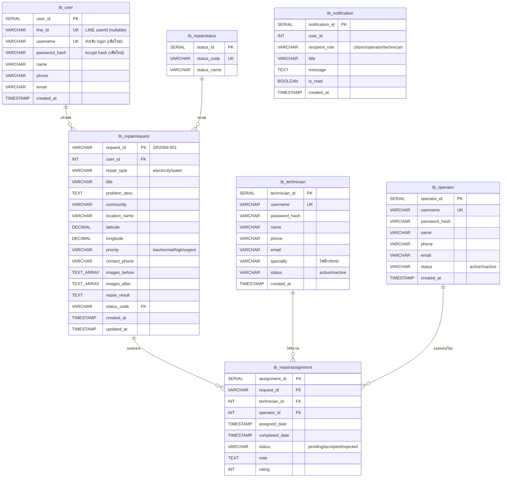

# 04 — โครงสร้างฐานข้อมูล (Database Schema)

## ER Diagram

## ตารางทั้งหมด (7 ตาราง)

### 1. tb_user — ประชาชน (ผู้แจ้ง)
| คอลัมน์ | ชนิด | คำอธิบาย |
|---------|------|---------|
| user_id | SERIAL PK | รหัสผู้ใช้ |
| line_id | VARCHAR(50) UK | LINE userId จาก LIFF (nullable) |
| username | VARCHAR(50) UK | ชื่อผู้ใช้สำหรับ login |
| password_hash | VARCHAR(255) | bcrypt hash |
| name | VARCHAR(100) | ชื่อ-นามสกุล |
| phone | VARCHAR(10) | เบอร์โทร |
| email | VARCHAR(100) | อีเมล |
| created_at | TIMESTAMP | วันที่สร้าง |

### 2. tb_operator — หัวหน้าช่าง / ผู้ดูแลระบบ
| คอลัมน์ | ชนิด | คำอธิบาย |
|---------|------|---------|
| operator_id | SERIAL PK | รหัส |
| username | VARCHAR(50) UK | ชื่อผู้ใช้ |
| password_hash | VARCHAR(255) | bcrypt hash |
| name | VARCHAR(100) | ชื่อ-นามสกุล |
| phone | VARCHAR(10) | เบอร์โทร |
| email | VARCHAR(100) | อีเมล |
| status | VARCHAR(20) | active / inactive |
| created_at | TIMESTAMP | วันที่สร้าง |

### 3. tb_technician — ช่างซ่อม
| คอลัมน์ | ชนิด | คำอธิบาย |
|---------|------|---------|
| technician_id | SERIAL PK | รหัส |
| username | VARCHAR(50) UK | ชื่อผู้ใช้ |
| password_hash | VARCHAR(255) | bcrypt hash |
| name | VARCHAR(100) | ชื่อ-นามสกุล |
| phone | VARCHAR(10) | เบอร์โทร |
| email | VARCHAR(100) | อีเมล |
| specialty | VARCHAR(100) | ความเชี่ยวชาญ (ไฟฟ้า/ประปา) |
| status | VARCHAR(20) | active / inactive |
| created_at | TIMESTAMP | วันที่สร้าง |

### 4. tb_repairstatus — สถานะงานซ่อม (lookup table)
| status_code | status_name |
|------------|-------------|
| reported | แจ้งแล้ว |
| accepted | รับเรื่องแล้ว |
| assigned | มอบหมายงานแล้ว |
| in_progress | กำลังดำเนินการ |
| completed | เสร็จสิ้น |
| cancelled | ยกเลิก |

### 5. tb_repairrequest — คำขอแจ้งซ่อม
| คอลัมน์ | ชนิด | คำอธิบาย |
|---------|------|---------|
| request_id | VARCHAR(20) PK | เลขที่แจ้งซ่อม (SR2569-001) |
| user_id | INT FK → tb_user | ผู้แจ้ง |
| repair_type | VARCHAR(50) | electricity / water |
| title | VARCHAR(150) | หัวเรื่อง |
| problem_desc | TEXT | รายละเอียดปัญหา |
| community | VARCHAR(100) | หมู่บ้าน/ชุมชน |
| location_name | VARCHAR(150) | ที่อยู่ |
| latitude / longitude | DECIMAL | พิกัด GPS |
| priority | VARCHAR(20) | low/normal/high/urgent |
| contact_phone | VARCHAR(10) | เบอร์ติดต่อ |
| images_before | TEXT[] | รูปก่อนซ่อม |
| images_after | TEXT[] | รูปหลังซ่อม |
| repair_result | TEXT | ผลการซ่อม |
| status_code | VARCHAR(30) FK | สถานะปัจจุบัน |
| created_at / updated_at | TIMESTAMP | เวลา |

### 6. tb_repairassignment — การมอบหมายงาน
| คอลัมน์ | ชนิด | คำอธิบาย |
|---------|------|---------|
| assignment_id | SERIAL PK | รหัส |
| request_id | VARCHAR(20) FK | คำขอ |
| technician_id | INT FK | ช่างที่ได้รับมอบหมาย |
| operator_id | INT FK | ผู้มอบหมาย |
| assigned_date | TIMESTAMP | วันที่มอบหมาย |
| completed_date | TIMESTAMP | วันที่เสร็จ |
| status | VARCHAR(20) | pending/accepted/rejected |
| note | TEXT | หมายเหตุ |
| rating | INT | คะแนน |

### 7. tb_notification — การแจ้งเตือน
| คอลัมน์ | ชนิด | คำอธิบาย |
|---------|------|---------|
| notification_id | SERIAL PK | รหัส |
| user_id | INT | ผู้รับ |
| recipient_role | VARCHAR(20) | citizen/operator/technician |
| title | VARCHAR(150) | หัวเรื่อง |
| message | TEXT | เนื้อหา |
| is_read | BOOLEAN | อ่านแล้วหรือยัง |
| created_at | TIMESTAMP | เวลา |

## Indexes
- `idx_repairrequest_status` → `tb_repairrequest(status_code)`
- `idx_repairrequest_user` → `tb_repairrequest(user_id)`
- `idx_assignment_technician` → `tb_repairassignment(technician_id)`
